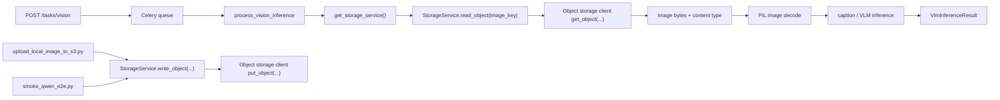

# Queue Flow

1. API 서버가 추론 요청을 큐에 적재합니다.
2. `apps/inference-server`의 Celery 워커가 작업을 가져옵니다.
3. 워커는 raw boto3 client 대신 `src.storage.s3`의 `StorageService` 경계를 통해 이미지를 읽습니다.
4. `api-server`는 `captures/{userId}/{yyyy}/{mm}/{dd}/{captureId}-{fileName}` 구조로 object key를 생성하거나 명시적 `imageKey`를 정규화합니다.
5. 로컬 업로드/스모크 스크립트도 같은 `StorageService`를 통해 이미지를 업로드합니다.
6. `StorageService`가 object storage client 생성, 기본 bucket 해석, 예외 매핑을 담당합니다.
7. 워커는 받은 이미지 바이트로 모델 추론을 수행하고 결과를 반환합니다.
8. retryable 오류는 Celery worker 실행 중 bounded backoff로 재시도합니다.

Object key 세부 규칙은 [object-storage-keys.md](./object-storage-keys.md)에 정리되어 있습니다.

## Operational Logs

`process_vision_inference` emits structured JSON logs through
`apps/inference-server/src/core/logging.py`.

Successful task logs include request and model context such as:

- `request_id`
- `image_key`
- `memory_id`
- `user_id`
- `model_key`
- `model_id`
- `model_mode`
- `quantization`
- `dtype_name`
- `settings_source`
- `soft_time_limit_sec`
- `hard_time_limit_sec`
- `fallback_model_key`
- `fallback_triggered`
- `latency_sec`
- `peak_memory_mb`

Failure and retry logs add operational decision fields:

- `error_code`
- `retryable`
- `failure_category`
- `retry_count`
- `max_retries`
- `retry_delay_sec`

Logs intentionally avoid storage credentials, raw image bytes, prompts, and
access URLs.



## Retry / Backoff Policy

`process_vision_inference` classifies worker failures before deciding whether to
return an error payload or schedule a Celery retry.

- Retryable errors:
  - `StorageAccessError`
  - `SoftTimeLimitExceeded`
  - `TimeoutError`
  - `RuntimeError`
  - unknown worker exceptions
- Non-retryable errors:
  - missing source images
  - storage configuration errors
  - invalid image bytes
  - invalid request values

Direct Python calls do not schedule Celery retries. This keeps unit tests and
local smoke helpers deterministic. When the task runs inside a Celery worker,
retryable failures schedule retries until `VISION_TASK_MAX_RETRIES` is reached.
After retry exhaustion, the worker returns the normalized VLM error contract with
`errorCode`, `retryable`, and `errorDetails`.

Retry settings:

- `VISION_TASK_MAX_RETRIES`
  - default: `2`
- `VISION_TASK_RETRY_DELAY_SEC`
  - default: `10`
  - first retry delay
- `VISION_TASK_RETRY_BACKOFF_MULTIPLIER`
  - default: `2.0`
  - multiplier applied per retry count
- `VISION_TASK_RETRY_MAX_DELAY_SEC`
  - default: max of `VISION_TASK_RETRY_DELAY_SEC` and `60`
  - upper bound for retry countdown

Delay calculation:

```text
delay = min(
  VISION_TASK_RETRY_DELAY_SEC * VISION_TASK_RETRY_BACKOFF_MULTIPLIER ^ retry_count,
  VISION_TASK_RETRY_MAX_DELAY_SEC
)
```
